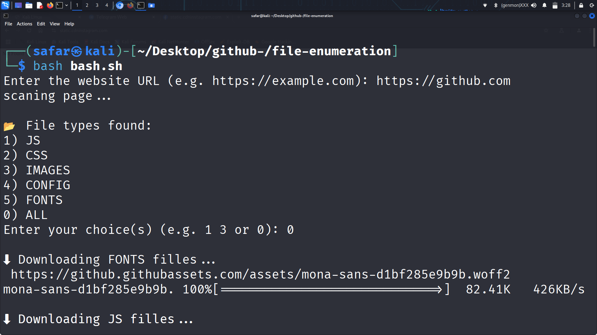

#  file-enumeration — Web File Extractor (Bash-based Recon Tool)

A lightweight Bash script that scans any website and downloads publicly accessible files like JS, CSS, fonts, images, audio, and more.

Ideal for  bug bounty recon,  OSINT,  pentest learning, or just deep inspection of how a site is structured.

---

##  Features

 Extracts downloadable resources from any URL  
 Supports interactive selection (e.g. only JS, or all files)  
 Auto-categorizes by file type  
 Supports `wget`-based downloads  
 Fully offline CLI tool (no dependency)

---

##  Supported File Types

| Type     | Extensions Covered                               |
|----------|--------------------------------------------------|
| HTML     | `.html`, `.htm`                                  |
| PHP      | `.php`                                           |
| CSS      | `.css`                                           |
| JS       | `.js`                                            |
| Images   | `.png`, `.jpg`, `.jpeg`, `.gif`, `.svg`, `.webp` |
| Audio    | `.mp3`, `.wav`, `.ogg`                           |
| Video    | `.mp4`, `.webm`, `.avi`                          |
| Config   | `.xml`, `.json`, `.env`, `.txt`                  |
| Archives | `.zip`, `.rar`, `.tar.gz`, `.bak`                |
| Fonts    | `.woff`, `.woff2`, `.ttf`                        |

---
## Demo




---
##  How to Use

```bash
git clone https://github.com/YOUR_USERNAME/file-enumeration.git
cd file-enumeration
chmod +x bash.sh
./bash.sh
```
